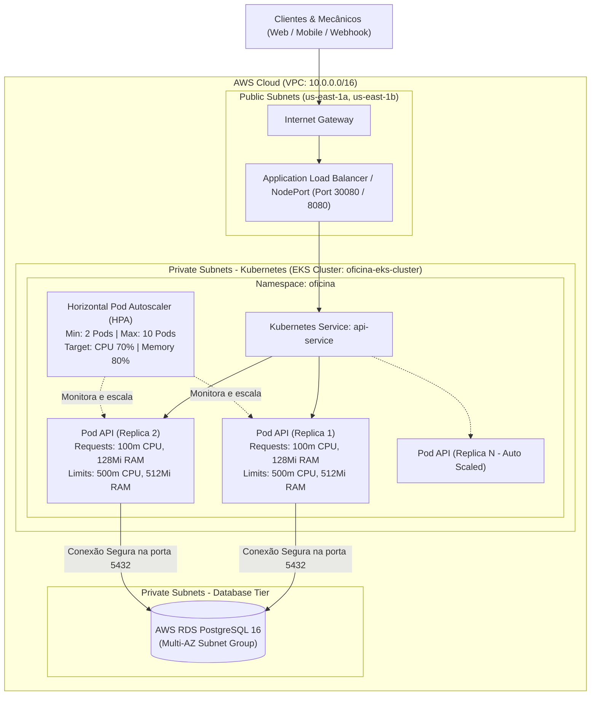
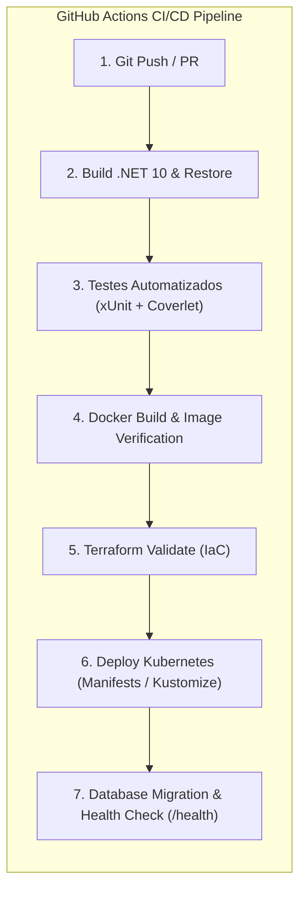

# Oficina Mecânica - Tech Challenge FIAP (Fase 2)

## SIAES - Sistema Integrado de Atendimento e Execução de Serviços

Este repositório contém a evolução da solução back-end para o **SIAES (Sistema Integrado de Atendimento e Execução de Serviços)**, desenvolvido para a gestão de uma oficina mecânica.

Na **Fase 2**, a aplicação foi evoluída para garantir **alta disponibilidade, resiliência, escalabilidade elástica e automação completa de infraestrutura**, incorporando orquestração com **Kubernetes (K8s)**, **Horizontal Pod Autoscaling (HPA)**, **Infraestrutura como Código (IaC)** com **Terraform**, esteiras de **CI/CD** com **GitHub Actions** e novos fluxos de negócio com **notificações por e-mail** e **webhooks de aprovação externa de orçamentos**.

---

## 🧭 Menu de Navegação

- [1. Como Executar a Aplicação](#1-como-executar-a-aplicação)
  - [1.1. Execução Local via Docker Compose (Recomendado)](#11-execução-local-via-docker-compose-recomendado)
  - [1.2. Deploy em Cluster Kubernetes (K8s)](#12-deploy-em-cluster-kubernetes-k8s)
  - [1.3. Provisionamento da Infraestrutura com Terraform](#13-provisionamento-da-infraestrutura-com-terraform)
  - [1.4. Execução dos Testes Automatizados](#14-execução-dos-testes-automatizados)
- [2. Desenho da Arquitetura Proposta](#2-desenho-da-arquitetura-proposta)
  - [2.1. Arquitetura da Aplicação (Clean Architecture & DDD)](#21-arquitetura-da-aplicação-clean-architecture--ddd)
  - [2.2. Arquitetura de Infraestrutura em Nuvem (AWS EKS & RDS)](#22-arquitetura-de-infraestrutura-em-nuvem-aws-eks--rds)
  - [2.3. Pipeline de Integração e Entrega Contínua (CI/CD)](#23-pipeline-de-integração-e-entrega-contínua-cicd)
- [3. Novas APIs e Funcionalidades da Fase 2](#3-novas-apis-e-funcionalidades-da-fase-2)
- [4. Orquestração e Escalabilidade (Kubernetes & HPA)](#4-orquestração-e-escalabilidade-kubernetes--hpa)
- [5. Infraestrutura como Código (Terraform)](#5-infraestrutura-como-código-terraform)
- [6. Qualidade, Testes e SonarQube](#6-qualidade-testes-e-sonarqube)
- [7. Coleções de Teste de API (Postman & Swagger)](#7-coleções-de-teste-de-api-postman--swagger)

---

## 1. Como Executar a Aplicação

### 📋 Pré-requisitos

- [Docker Desktop](https://www.docker.com/products/docker-desktop/) (com suporte a `docker compose` e Kubernetes local habilitado se desejar rodar K8s localmente).
- [.NET 10 SDK](https://dotnet.microsoft.com/download/dotnet/10.0) (opcional para compilação local fora de contêineres).
- [kubectl](https://kubernetes.io/docs/tasks/tools/) e [Terraform CLI](https://developer.hashicorp.com/terraform/downloads) (para deploy em K8s e IaC).

---

### 1.1. Execução Local via Docker Compose (Recomendado)

O ambiente completo (API .NET 10, PostgreSQL 18 e SonarQube) é inicializado de forma orquestrada com verificação de integridade (_healthcheck_):

```bash
docker compose up --build
```

- **API & Swagger**: `http://localhost:8080` (redireciona automaticamente para `/swagger`).
- **Health Check da Aplicação**: `http://localhost:8080/health`.
- **SonarQube**: `http://localhost:9000` (usuário: `admin` / senha inicial: `admin`).

---

### 1.2. Deploy em Cluster Kubernetes (K8s)

Os manifestos declarativos estão localizados no diretório [`k8s/`](k8s/) e são orquestrados via Kustomize:

```bash
# 1. Aplicar todos os recursos no cluster (Namespace, ConfigMaps, Secrets, PVC, Postgres, API e HPA)
kubectl apply -k k8s/

# 2. Verificar o status dos pods e serviços no namespace da oficina
kubectl get pods,services,hpa -n oficina
```

Para acessar a API exposta pelo NodePort do Kubernetes:

- **URL**: `http://localhost:30080` (ou IP do Node no NodePort `30080`).

---

### 1.3. Provisionamento da Infraestrutura com Terraform

Os scripts para provisionamento automático da infraestrutura gerenciada na AWS (VPC, EKS Cluster, Managed Node Groups, RDS PostgreSQL) estão no diretório [`infra/`](infra/):

```bash
cd infra

# 1. Copiar variáveis de exemplo
cp terraform.tfvars.example terraform.tfvars

# 2. Inicializar o Terraform
terraform init

# 3. Planejar a criação dos recursos
terraform plan -out=tfplan

# 4. Aplicar o provisionamento
terraform apply tfplan
```

Para detalhes completos sobre os recursos criados pelo Terraform, consulte a [Documentação de Infraestrutura (infra/README.md)](infra/README.md).

---

### 1.4. Execução dos Testes Automatizados

A suíte conta com **145 testes automatizados** cobrindo regras de negócio, invariantes de domínio, transições de status da OS, cálculo atômico de orçamentos, baixa transacional de estoque e chamadas REST:

```bash
dotnet test
```

Para gerar o relatório de cobertura de código em formato OpenCover:

```bash
dotnet test --collect:"XPlat Code Coverage" --settings coverlet.runsettings
```

---

## 2. Desenho da Arquitetura Proposta

### 2.1. Arquitetura da Aplicação (Clean Architecture & DDD)

```mermaid
graph TD
    subgraph "API Layer (ASP.NET Core .NET 10)"
        CTRL_ADM["Admin Controllers (/api/admin/*)"]
        CTRL_PUB["Public Controllers (/api/public/*)"]
        FILTERS["Filtro Global de Exceção"]
        SWAGGER["Swagger / OpenAPI"]
        HEALTH["Health Checks (/health)"]
    end

    subgraph "Application Layer"
        UC_OS["Use Cases - Ordens de Serviço"]
        UC_CLI["Use Cases - Clientes & Veículos"]
        UC_PEC["Use Cases - Peças & Serviços"]
        DTOS["DTOs & Mappings"]
        VALID["FluentValidation"]
    end

    subgraph "Domain Layer (Núcleo Puro DDD)"
        AGG_OS["Agregado OrdemServico"]
        AGG_CLI["Agregado Cliente"]
        AGG_VEI["Agregado Veiculo"]
        AGG_PEC["Agregado Peca & Servico"]
        VOS["Value Objects (Cpf, Placa, Cnpj)"]
        NOTIF_INT["IServicoNotificacao"]
        UOW["IUnitOfWork"]
    end

    subgraph "Infrastructure Layer"
        EF_CTX["OficinaDbContext (EF Core 10)"]
        REPOS["Repositórios SQL"]
        MAPS["Fluent API Mappings"]
        SVC_MAIL["EmailNotificacaoService"]
        SVC_JWT["TokenService"]
    end

    CTRL_ADM --> UC_OS
    CTRL_ADM --> UC_CLI
    CTRL_ADM --> UC_PEC
    CTRL_PUB --> UC_OS

    UC_OS --> AGG_OS
    UC_OS --> NOTIF_INT
    UC_OS --> UOW
    UC_CLI --> AGG_CLI
    UC_CLI --> AGG_VEI
    UC_PEC --> AGG_PEC

    EF_CTX -.-> UOW
    REPOS -.-> Domain
    SVC_MAIL -.-> NOTIF_INT
    Infrastructure --> PostgreSQL[("PostgreSQL 18 / RDS")]
```



---

### 2.2. Arquitetura de Infraestrutura em Nuvem (AWS EKS & RDS)



---

### 2.3. Pipeline de Integração e Entrega Contínua (CI/CD)



---

## 3. Novas APIs e Funcionalidades da Fase 2

A camada de aplicação e os controladores REST foram expandidos e refatorados com os seguintes aprimoramentos:

| Funcionalidade / API                    | Endpoint                                                        | Método | Descrição                                                                                                                                                                                     |
| :-------------------------------------- | :-------------------------------------------------------------- | :----: | :-------------------------------------------------------------------------------------------------------------------------------------------------------------------------------------------- |
| **Abertura de OS com Peças e Serviços** | `/api/admin/ordens-servico`                                     | `POST` | Permite abrir a OS informando diretamente cliente, veículo, itens de peças e mão de obra, gerando a OS e seu identificador único.                                                             |
| **Consulta Pontual de Status da OS**    | `/api/public/ordens-servico/{id}/status`                        | `GET`  | Endpoint público para clientes acompanharem o status atual da OS (_Recebida_, _Diagnóstico_, _Aguardando Aprovação_, _Execução_, _Finalizada_, _Entregue_).                                   |
| **Consulta de Status (Admin)**          | `/api/admin/ordens-servico/{id}/status`                         | `GET`  | Consulta administrativa de status detalhado com datas de execução e finalização.                                                                                                              |
| **Webhook de Notificação de Orçamento** | `/api/public/ordens-servico/{id}/notificacao-orcamento`         | `POST` | Recebe notificações externas (ex: WhatsApp Bot, link de aprovação) de aprovação (`aprovado: true`) ou recusa (`aprovado: false`).                                                             |
| **Listagem Ordenada por Status e Data** | `/api/admin/ordens-servico`                                     | `GET`  | Lista ordens aplicando ordenação por status (_Em Execução_ > _Aguardando Aprovação_ > _Em Diagnóstico_ > _Recebida_), mais antigas primeiro e omissão automática de OS finalizadas/entregues. |
| **Notificação de Status por E-mail**    | Disparo automático + `/api/admin/ordens-servico/{id}/notificar` | `POST` | Notifica o cliente por e-mail sobre transições de status e permite reenvio manual pela equipe da oficina.                                                                                     |
| **Health Check da Aplicação**           | `/health`                                                       | `GET`  | Endpoint de integridade para liveness e readiness probes do Kubernetes.                                                                                                                       |

Para detalhes completos de requisição (`curl`), payloads JSON e respostas, consulte o [Guia da API (docs/api_reference.md)](docs/api_reference.md).

---

## 4. Orquestração e Escalabilidade (Kubernetes & HPA)

Os manifestos em [`k8s/`](k8s/) configuram um ambiente Kubernetes pronto para produção:

- **Deployment com Probes**: `livenessProbe` e `readinessProbe` monitorando o endpoint `/health`.
- **Resource Management**: Definição explícita de `requests` (`cpu: 100m`, `memory: 128Mi`) e `limits` (`cpu: 500m`, `memory: 512Mi`).
- **Horizontal Pod Autoscaler (HPA)**:
  - Escala automaticamente de **2 réplicas mínimas** até **10 réplicas máximas**.
  - Gatilhos de autoescalabilidade: **70% de consumo médio de CPU** ou **80% de consumo médio de memória**.
- **Configuração Segura**: Variáveis sensíveis (senhas, connection strings e chaves JWT) isoladas em `Secret` e dados operacionais em `ConfigMap`.
- **Persistência**: `PersistentVolumeClaim` de 5Gi para o banco de dados PostgreSQL.

---

## 5. Infraestrutura como Código (Terraform)

A infraestrutura é provisionada como código utilizando módulos e recursos nativos da AWS em [`infra/`](infra/):

- **VPC e Subnets**: Rede pública e privada multi-AZ com Internet Gateway e Route Tables configuradas para Kubernetes.
- **Cluster EKS**: Control plane versão 1.30 com papéis IAM restritos (`AmazonEKSClusterPolicy`).
- **Managed Node Groups**: EC2 worker nodes com auto-recuperação (`AmazonEKSWorkerNodePolicy`, `AmazonEKS_CNI_Policy`).
- **RDS PostgreSQL**: Banco de dados relacional gerenciado em subnet privada sem exposição pública.

---

## 6. Qualidade, Testes e SonarQube

- **Testes Automatizados**: Cobertura de 100% dos fluxos de domínio e casos de uso da aplicação.
- **Análise Estática de Código (SAST & SCA)**: Zero vulnerabilidades no código-fonte e dependências.
- **SonarQube Local**:

  ```bash
  # 1. Subir o SonarQube
  docker compose up -d sonarqube

  # 2. Executar script de análise com envio de métricas de cobertura
  ./run-sonar.sh
  ```

---

## 7. Coleções de Teste de API (Postman & Swagger)

- **Swagger Interativo**: Disponível em `http://localhost:8080/swagger` com autenticação JWT integrada.
- **Postman Collection**: Arquivo [`OficinaMecanica.postman_collection.json`](OficinaMecanica.postman_collection.json) contendo 18 requisições sequenciais cobrindo todo o caminho feliz (autenticação, cadastros, abertura completa de OS, diagnóstico, webhook de aprovação, entrega, consultas e healthcheck).

---
