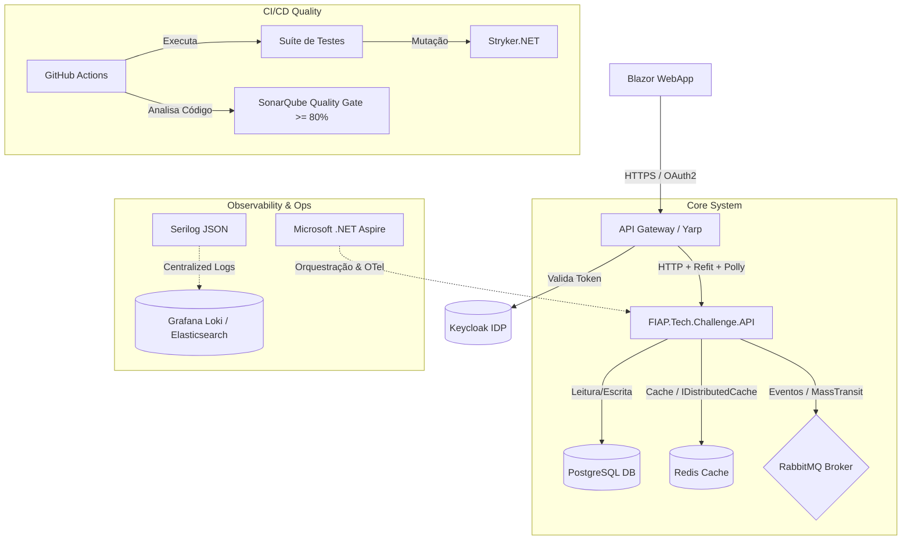

# Plano de Evolução Arquitetural - Oficina Mecânica (SIAES)

Este documento apresenta o plano estratégico para a evolução da arquitetura do sistema **Oficina Mecânica (SIAES)** de forma direta e concisa.

---

## 🗺️ Visão Geral da Arquitetura Alvo

A evolução arquitetural propõe a estruturação sob o conceito de **Monolito Modular** ou **Microsserviços**, guiado pelas seguintes integrações:

---

## 1. Centralização de Identidade (IDP com Keycloak)

* **Cenário Atual**: Autenticação simplificada com JWTs emitidos e assinados localmente pela API.
* **Evolução Proposta**: Migração para o **Keycloak** atuando como Identity Provider (IdP) corporativo, adotando os padrões **OAuth 2.1** e **OpenID Connect (OIDC)**.
* **Detalhamento**:
  - Uso de `Microsoft.AspNetCore.Authentication.JwtBearer` configurado para validação via `Authority` / endpoints `JWKS`.
  - Controle de acessos via perfis (RBAC) com claims (`Admin`, `Mecanico`, `Cliente`) aplicadas com `[Authorize(Roles = "...")]`.

---

## 2. Orquestração e Observabilidade Local (.NET Aspire)

* **Cenário Atual**: Serviços de apoio (PostgreSQL, etc.) gerenciados de forma isolada e manual no `docker-compose.yml`.
* **Evolução Proposta**: Introdução do **.NET Aspire** como centralizador e orquestrador de desenvolvimento local.
* **Projetos**:
  - `OficinaMecanica.AppHost`: Orquestrador C# das dependências e da API.
  - `OficinaMecanica.ServiceDefaults`: Configurações centralizadas de telemetria (OpenTelemetry), resiliência padrão e health checks.

---

## 3. Testes de Mutação com Stryker (Stryker.NET)

* **Cenário Atual**: Qualidade de testes avaliada unicamente por cobertura estrutural de código (linhas/ramos).
* **Evolução Proposta**: Integração do **Stryker.NET** no pipeline de CI/CD para avaliar a eficácia real das asserções dos testes (geração e execução contra mutantes de código).

---

## 4. Resiliência e Consumo HTTP (Polly & Refit)

* **Cenário Atual**: Inexistência de chamadas para APIs externas/sistemas satélites com tratamento de falhas.
* **Evolução Proposta**: Implementação de consumo de APIs utilizando **Refit** (definição de clientes em interfaces) em conjunto com o **Polly** para resiliência transitória.
* **Padrões**: *Retry* (recuo exponencial), *Circuit Breaker*, *Timeout* e *Bulkhead*.

---

## 5. Comunicação Assíncrona e Event-Driven (RabbitMQ / MassTransit)

* **Cenário Atual**: Fluxos secundários da Ordem de Serviço (estoque, faturamento) processados de forma síncrona no ciclo HTTP da API.
* **Evolução Proposta**: Adoção de mensageria com **RabbitMQ** sob a abstração do **MassTransit** para processamento assíncrono e desacoplado.
* **Padrões**: *Event Publishing*, *Transactional Outbox Pattern* (consistência de dados local/fila) e *Dead Letter Queue (DLQ)*.

---

## 6. Cache Distribuído (Redis)

* **Cenário Atual**: Leitura direta e frequente no banco de dados principal para listagens estáticas ou semi-estáticas.
* **Evolução Proposta**: Configuração de cache distribuído em memória utilizando **Redis** integrado à interface `IDistributedCache`.
* **Padrões**: *Cache-Aside* e expurgo/invalidação ativa nas operações de escrita.

---

## 7. Telemetria e Logs Estruturados (Serilog)

* **Cenário Atual**: Logs gerados como texto simples não estruturado na saída de console padrão.
* **Evolução Proposta**: Substituição pelo **Serilog** configurado para gerar logs estruturados em formato **JSON** indexável.
* **Detalhamento**: Correlação de fluxos (Correlation ID) transacionais em logs e envio assíncrono para agregadores (Grafana Loki ou Elasticsearch).

---

## 8. Frontend Web (Blazor WebApp)

* **Cenário Atual**: Interações de teste e validações realizadas diretamente via Swagger ou chamadas HTTP manuais.
* **Evolução Proposta**: Construção da interface com o usuário utilizando **Blazor WebApp** (.NET 10).
* **Detalhamento**:
  - Uso de renderização interativa (Interactive Server / WebAssembly) para interface de alta performance.
  - Autenticação e proteção de rotas integradas diretamente com o Keycloak via OIDC.
  - Comunicação via API Gateway consumindo endpoints RESTful tipados.

---

## 9. Integração Contínua (GitHub Actions & SonarQube)

* **Cenário Atual**: Execução local de testes e validação de qualidade sem automação de pipeline.
* **Evolução Proposta**: Criação de pipelines automatizados via **GitHub Actions** integrados com **SonarQube/SonarCloud**.
* **Detalhamento**:
  - Execução de build e testes automáticos a cada Pull Request e push nas branches principais.
  - Validação de Quality Gate no SonarQube com bloqueio de merge se a cobertura de testes for inferior a **80%**.

---

## 10. Estratégia de Branching (Trunk-Based Development)

* **Cenário Atual**: Fluxo de trabalho de versionamento sem padrão formalizado.
* **Evolução Proposta**: Adoção da estratégia **Trunk-Based Development (TBD)** para agilidade de entrega.
* **Detalhamento**:
  - Branch estável única (`main` / `trunk`) como destino principal e pronta para produção.
  - Uso de *Short-lived Feature Branches* (ciclo de vida de no máximo 1 a 2 dias).
  - Integrações rápidas e feedbacks contínuos através de Pull Requests pequenos e automação do CI.
