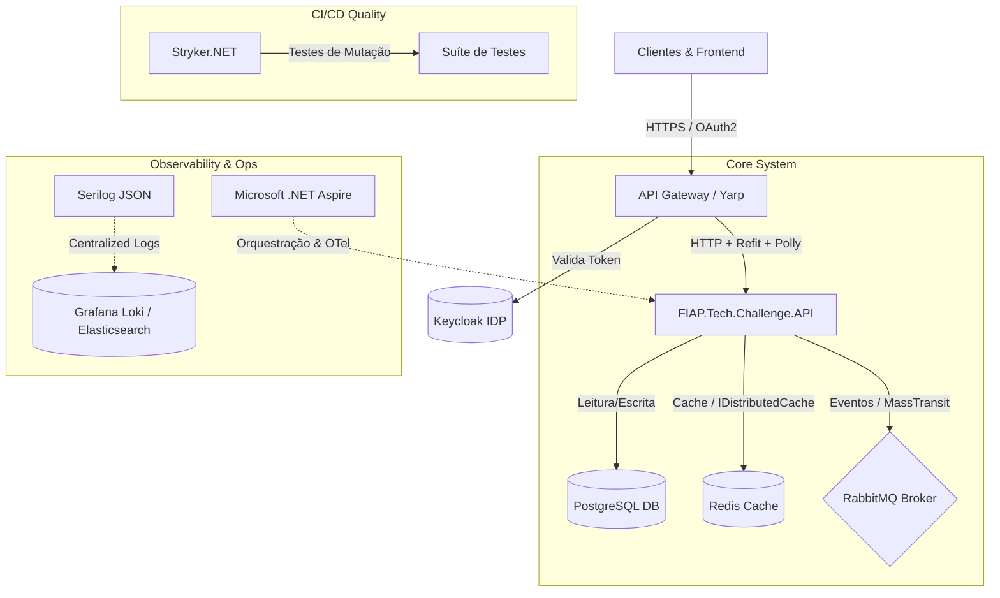
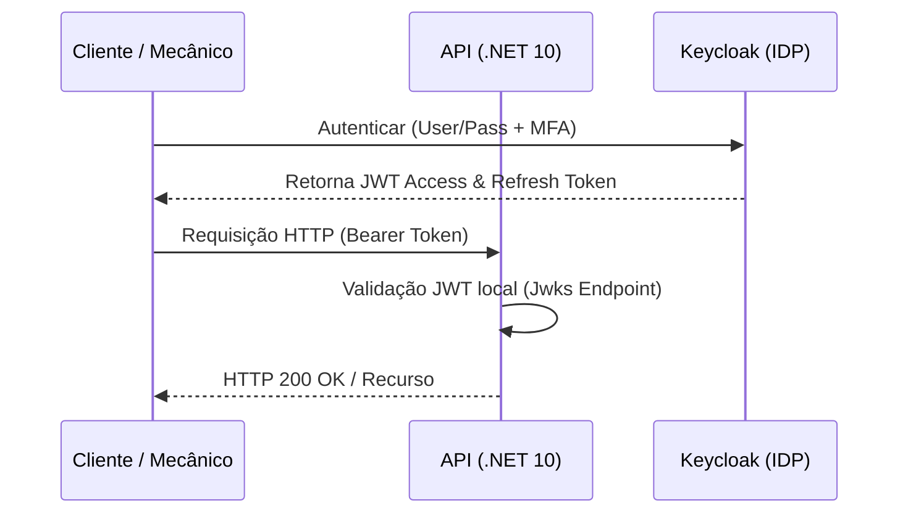

# Plano de Evolução Arquitetural - Oficina Mecânica (SIAES)

Este documento apresenta o plano estratégico para a evolução da arquitetura do sistema **Oficina Mecânica (SIAES)**. Ele detalha as decisões tecnológicas de arquitetura corporativa para suportar alta disponibilidade, resiliência, segurança avançada, observabilidade refinada e qualidade extrema de entrega contínua.

---

## 🗺️ Visão Geral da Arquitetura Alvo

A evolução arquitetural propõe a transformação do monolito clássico em um ecossistema pronto para a nuvem, estruturado sob o conceito de **Monolito Modular** ou **Microsserviços**, guiado pelas seguintes integrações:



---

## 1. Centralização de Identidade (IDP com Keycloak)

### 📌 Cenário Atual

A autenticação e autorização são efetuadas por meio de uma emissão própria e simplificada de tokens JWT assinados localmente pela API corporativa para fins de validação do MVP.

### 🚀 Evolução Proposta

Delegar o fluxo de autenticação e controle de sessões para o **Keycloak** atuando como Identity Provider (IdP) corporativo, adotando os padrões de mercado **OAuth 2.1** e **OpenID Connect (OIDC)**.



* **Configuração no .NET**: Utilizar o pacote `Microsoft.AspNetCore.Authentication.JwtBearer` configurado para validar a assinatura apontando para o endpoint do Keycloak (`Authority`), consultando as chaves criptográficas públicas automaticamente (`JWKS`).
* **Controle de Acessos (RBAC/ABAC)**: Utilizar *Claims* customizadas retornadas no token para o controle fino de perfis (`Admin`, `Mecanico`, `Cliente`) mapeados diretamente nos atributos `[Authorize(Roles = "...")]` do ASP.NET Core.
* **Benefícios**: Delegação de segurança de alta complexidade (MFA, recuperação de senha, integração com diretórios externos como Active Directory/LDAP) e conformidade com a LGPD.

---

## 2. Orquestração e Observabilidade Local (.NET Aspire)

### 📌 Cenário Atual

Os serviços de apoio (como PostgreSQL e SonarQube) são declarados manualmente por meio de um arquivo `docker-compose.yml` que gerencia containers isolados.

### 🚀 Evolução Proposta

Introduzir o **.NET Aspire** como padrão de orquestração local de recursos e infraestrutura, adicionando os projetos:

1. **`OficinaMecanica.AppHost`**: Projeto orquestrador em C# responsável por gerenciar o ciclo de vida da API e suas dependências (Banco, Redis, RabbitMQ) via código.
2. **`OficinaMecanica.ServiceDefaults`**: Centralização de configurações de resiliência, telemetria (OpenTelemetry) e health checks para todas as futuras APIs/Microsserviços.

* **Benefícios**:
  * **Dashboard Unificado**: Visualização em tempo real de traces distribuídos, métricas estruturadas e logs do console do ecossistema .NET.
  * **Provedores Integrados (Aspire Components)**: Registro transparente e injeção automática de dependências e resiliência via código C# (`AddNpgsqlDbContext`, `AddRedisClient`).

---

## 3. Testes de Mutação com Stryker (Stryker.NET)

### 📌 Cenário Atual

A qualidade das asserções e testes automatizados é avaliada puramente pela cobertura de código estrutural (linhas e ramos cobertos), validada localmente e no SonarQube.

### 🚀 Evolução Proposta

Integrar o framework de testes de mutação **Stryker.NET** no pipeline de CI/CD para avaliar se a suíte de testes realmente blinda o sistema contra defeitos.

* **Como funciona**:

    ```
    Código Fonte Original  -->  Stryker altera um operador (ex: muda '>' para '<=')
                                 -->  Gera um "Mutante"
                                       -->  Roda a suíte de testes
                                             -->  Se o teste falhar: Mutante MORRE (Bom!)
                                             -->  Se o teste passar: Mutante SOBREVIVE (Alerta!)
    ```

* **Configuração**: Executado via ferramenta global dotnet (`dotnet stryker`) gerando relatórios detalhados com o *Mutation Score* (percentual de mutantes mortos pela suíte de testes).
* **Benefícios**: Garante que os testes possuem asserções (`Asserts`) inteligentes e cobrem caminhos lógicos reais de negócios, impedindo a existência de testes "falsos positivos" que cobrem a linha sem checar as consequências das decisões lógicas.

---

## 4. Resiliência e Consumo HTTP (Polly & Refit)

### 📌 Cenário Atual

Não há chamadas para APIs de terceiros estruturadas. Em futuras integrações de rede com sistemas satélites, há riscos de falhas transitórias causarem gargalos síncronos na API principal.

### 🚀 Evolução Proposta

Estruturar o consumo de APIs externas adotando a combinação de **Refit** (definição de clientes HTTP fortemente tipados orientados a interfaces) e **Polly** (resiliência).

* **Padrões de Resiliência Implementados via Polly**:
  * **Retry Pattern**: Tentativas automáticas com recuo exponencial para falhas temporárias de rede.
  * **Circuit Breaker**: Interrupção temporária de conexões para serviços externos indisponíveis para evitar desperdício de recursos locais e travamento de threads.
  * **Timeout & Bulkhead**: Limite de tempo de resposta e isolamento de recursos concorrentes.
* **Exemplo de Código Técnico**:

    ```csharp
    services.AddRefitClient<IFornecedorPecasClient>()
            .ConfigureHttpClient(c => c.BaseAddress = new Uri("https://api.fornecedor.com"))
            .AddPolicyHandler(HttpPolicyExtensions
                .HandleTransientHttpError()
                .WaitAndRetryAsync(3, retryAttempt => TimeSpan.FromSeconds(Math.Pow(2, retryAttempt))))
            .AddPolicyHandler(HttpPolicyExtensions
                .HandleTransientHttpError()
                .CircuitBreakerAsync(handledEventsAllowedBeforeBreaking: 5, durationOfBreak: TimeSpan.FromSeconds(30)));
    ```

---

## 5. Comunicação Assíncrona e Event-Driven (Mensageria com RabbitMQ / MassTransit)

### 📌 Cenário Atual

Processos secundários da Ordem de Serviço (como alteração cadastral, baixa de itens do estoque e faturamento) ocorrem síncronamente durante o ciclo da requisição HTTP do controller.

### 🚀 Evolução Proposta

Introduzir o processamento distribuído assíncrono baseado em eventos usando o **RabbitMQ** como message broker sob a abstração do **MassTransit**.

* **Padrões de Integração**:
  * **Event Publishing**: Ao faturar uma OS, a API publica o evento `OrdemServicoFinalizadaEvent` no broker. Consumidores de outros módulos processam o envio de e-mails, notas fiscais e relatórios gerenciais de forma isolada.
  * **Transactional Outbox Pattern**: Garante que o evento seja enviado ao Broker apenas se a gravação das alterações no PostgreSQL for realizada com sucesso dentro da mesma transação, prevenindo inconsistências distribuídas.
  * **Resiliência nas Filas**: Configuração automática de retentativas locais, Redelivery atrasado e encaminhamento para filas de erro (`Dead Letter Queue - DLQ`) para análise.

---

## 6. Cache Distribuído (Redis)

### 📌 Cenário Atual

A cada requisição à API para listar peças ou verificar configurações, uma consulta SQL de leitura direta é efetuada no banco de dados.

### 🚀 Evolução Proposta

Configurar um cache distribuído em memória com **Redis** acoplado à interface padronizada do .NET `IDistributedCache`.

* **Estratégias de Cache**:
  * **Cache-Aside Pattern**: A API tenta obter os dados do Redis. Se houver falha de cache (Cache Miss), lê do banco, salva no Redis e retorna ao cliente.
  * **Invalidamento**: Ao cadastrar ou alterar peças e estoque, as chaves correspondentes no Redis são automaticamente expurgadas para garantir a consistência das leituras subsequentes.
* **Benefícios**: Redução expressiva na latência de leitura das listagens gerais da API pública e redução do consumo de recursos (CPU/I-O) do banco de dados principal.

---

## 7. Telemetria e Logs Estruturados (Serilog)

### 📌 Cenário Atual

O logging utiliza a saída padrão de console do .NET, gerando texto puro não indexado e de difícil busca em ambientes de produção.

### 🚀 Evolução Proposta

Substituir o logging nativo pelo **Serilog** configurado para gerar logs estruturados em formato **JSON**, contendo propriedades ricas indexáveis.

* **Arquitetura de Logging**:
  * **Correlation ID**: Inserção automática de identificadores de correlação em todas as requisições HTTP e eventos assíncronos via middlewares. Isso permite rastrear uma transação inteira do cliente por todas as camadas e microsserviços.
  * **Sinks de Destino**: Envio assíncrono de logs estruturados para ferramentas de consolidação como **Grafana Loki** ou **Elasticsearch (ELK Stack)**.
* **Benefícios**: Pesquisas e diagnósticos ultra rápidos, monitoramento ativo de comportamentos incomuns e geração de alertas automatizados a partir do conteúdo estruturado dos logs.
