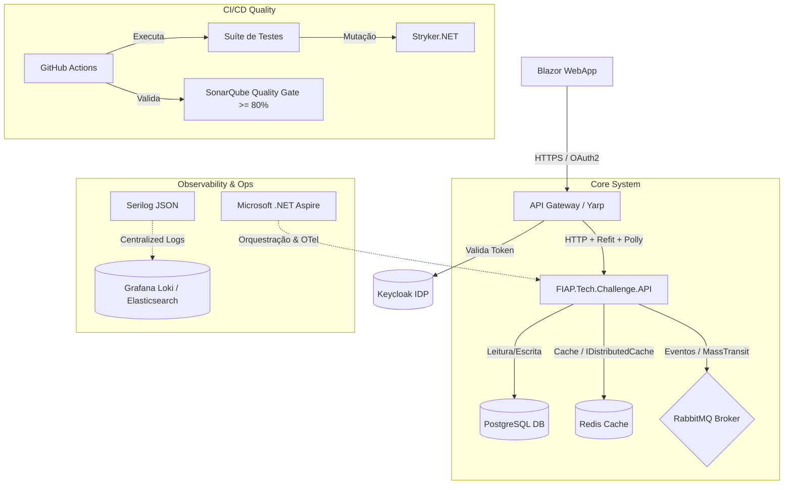

# Plano de Evolução Arquitetural - Oficina Mecânica (SIAES)

Este documento apresenta o estado atual e o plano estratégico de evolução da arquitetura do sistema **Oficina Mecânica (SIAES)**.

---

## 🗺️ Visão Geral da Arquitetura Alvo

A evolução propõe a estruturação da aplicação sob uma arquitetura modular, resiliente e escalável:

---

## 🛠️ Tecnologias Atuais (Fase 1)

O MVP foi concebido com a seguinte infraestrutura técnica de base:

* **Arquitetura**: Monolito clássico com separação lógica em camadas (Clean Architecture) via namespaces/projetos.
* **Banco de Dados**: PostgreSQL 18 como banco relacional principal em container Docker.
* **Persistência**: Entity Framework Core como ORM principal.
* **Segurança Básica**: Autenticação via JWT assinado localmente com HMAC-SHA256, proteção contra IDOR por meio de Guids públicos e prevenção automatizada a SQL Injection pelo EF Core.
* **Testes e Qualidade**: Testes de unidade e testes integrados desenvolvidos com xUnit, NSubstitute e FluentAssertions.
* **Análise Estática**: Integração de testes e cobertura via SonarQube executado em container local.

---

## 🚀 Melhorias e Evolução da Arquitetura

Para suportar alta escala, segurança de nível corporativo e monitoramento avançado, as seguintes melhorias estão planejadas:

### 1. Centralização de Identidade (IDP com Keycloak)
* **Objetivo**: Delegar a autenticação de usuários para o **Keycloak** usando **OAuth 2.1** e **OIDC**.
* **Melhoria**: Uso de chaves públicas via endpoint `JWKS` do Keycloak e controle fino de perfis (RBAC/ABAC) associados às roles (`Admin`, `Mecanico`, `Cliente`).

### 2. Orquestração e Observabilidade Local (.NET Aspire)
* **Objetivo**: Padronizar a orquestração do ecossistema e unificar traces e logs de serviços.
* **Melhoria**:
  - `OficinaMecanica.AppHost`: Orquestrador C# do ciclo de vida de recursos e dependências.
  - `OficinaMecanica.ServiceDefaults`: Políticas centralizadas de telemetria (OpenTelemetry), resiliência e health checks.

### 3. Testes de Mutação com Stryker (Stryker.NET)
* **Objetivo**: Garantir a eficácia das asserções de testes contra falhas silenciosas.
* **Melhoria**: Execução do **Stryker.NET** no pipeline de CI para modificar dinamicamente operadores matemáticos/lógicos e validar se a suíte de testes captura o mutante.

### 4. Resiliência e Consumo HTTP (Polly & Refit)
* **Objetivo**: Tornar seguras e resilientes as chamadas para APIs satélites de terceiros (ex: peças).
* **Melhoria**: Definição de contratos via **Refit** acoplados a políticas de retry, circuit breaker e fallback do **Polly**.

### 5. Comunicação Assíncrona e Event-Driven (RabbitMQ / MassTransit)
* **Objetivo**: Desacoplar fluxos secundários (como faturamento ou atualização de estoque) das requisições HTTP da API.
* **Melhoria**: Integração orientada a eventos usando **RabbitMQ** e **MassTransit**, com resiliência baseada em *Transactional Outbox Pattern* e tratamento de exceções com *Dead Letter Queue (DLQ)*.

### 6. Cache Distribuído (Redis)
* **Objetivo**: Aliviar a carga de leitura no banco de dados para informações altamente consultadas.
* **Melhoria**: Implementação de cache distribuído em memória com **Redis** e `IDistributedCache` usando *Cache-Aside* e invalidação na alteração de dados.

### 7. Telemetria e Logs Estruturados (Serilog)
* **Objetivo**: Obter logs ricos estruturados para diagnósticos em tempo real em produção.
* **Melhoria**: Substituição pelo **Serilog** gerando logs em formato JSON com injeção automática de `Correlation ID` e envio assíncrono a agregadores como Grafana Loki.

### 8. Frontend Web (Blazor WebApp)
* **Objetivo**: Oferecer uma aplicação SPA integrada e fluida.
* **Melhoria**: Construção da UI em **Blazor WebApp** (.NET 10) utilizando renderização dinâmica (Server/WebAssembly) com segurança unificada via Keycloak.

### 9. Integração Contínua (GitHub Actions & SonarQube)
* **Objetivo**: Garantir portas de qualidade automáticas no fluxo de desenvolvimento.
* **Melhoria**: Pipelines de build no **GitHub Actions** que testam o código e validam o Quality Gate no SonarQube, exigindo cobertura mínima de **80%** para liberação do merge.

### 10. Estratégia de Branching (Trunk-Based Development)
* **Objetivo**: Acelerar a frequência de entregas e reduzir conflitos de merges.
* **Melhoria**: Adoção de **Trunk-Based Development** com branches de curta duração integradas rapidamente na branch estável principal (`main`).

### 11. Testes de Segurança com Foco no OWASP Top 10
* **Objetivo**: Garantir que as principais vulnerabilidades Web descritas pelo OWASP sejam verificadas rotineiramente.
* **Melhoria**: Integração de scanners dinâmicos (DAST), como OWASP ZAP, no pipeline de CI/CD para detectar automaticamente brechas de segurança de nível de aplicação.

### 12. Bloqueio de Pipeline por Vulnerabilidades de Segurança (SCA/SAST)
* **Objetivo**: Bloquear preventivamente deploys se brechas de segurança forem introduzidas.
* **Melhoria**: Etapa obrigatória no pipeline de build que roda o scanner SCA (`dotnet list package --vulnerable --include-transitive`) e ferramentas SAST. Caso vulnerabilidades de severidade Média, Alta ou Crítica sejam detectadas nas dependências ou no código-fonte, o build é finalizado com falha, bloqueando automaticamente o merge e a liberação de novos artefatos.
